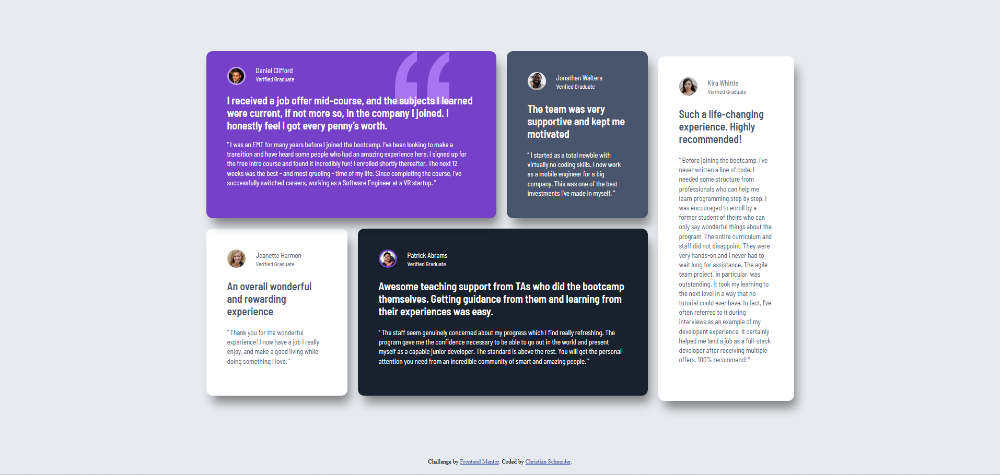
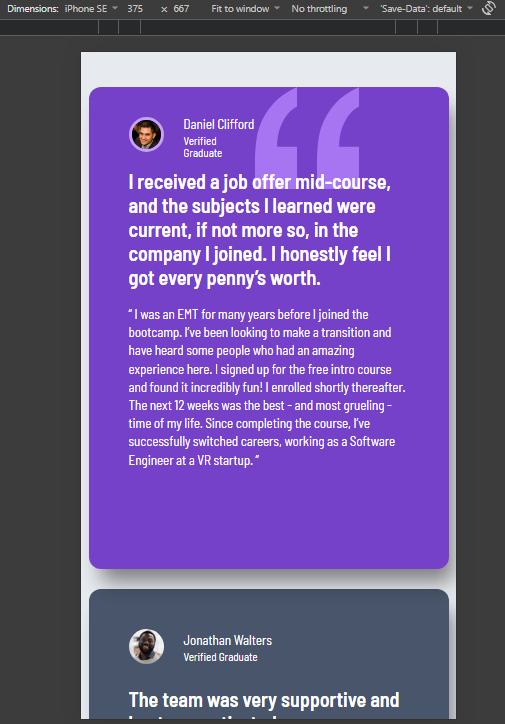

# Frontend Mentor - Testimonials grid section solution

This is a solution to the [Testimonials grid section challenge on Frontend Mentor](https://www.frontendmentor.io/challenges/testimonials-grid-section-Nnw6J7Un7). Frontend Mentor challenges help you improve your coding skills by building realistic projects.

## Table of contents

- [Overview](#overview)
  - [The challenge](#the-challenge)
  - [Screenshot](#screenshot)
  - [Links](#links)
- [My process](#my-process)
  - [Built with](#built-with)
  - [What I learned](#what-i-learned)
  - [Continued development](#continued-development)
  - [Useful resources](#useful-resources)
  - [AI Collaboration](#ai-collaboration)

**Note: Delete this note and update the table of contents based on what sections you keep.**

## Overview

### The challenge

Users should be able to:

- View the optimal layout for the site depending on their device's screen size

### Screenshot

### Links

- Solution URL: [Add solution URL here](https://chrisschneider89.github.io/fm_j_testimonials-grid-section/)
- Live Site URL: [Add live site URL here](https://github.com/chrisSchneider89/fm_j_testimonials-grid-section)

## My process

### Built with

- Semantic HTML5 markup
- CSS custom properties
- CSS Grid
- Flexbox
- Nested media queries

### What I learned

I've completed my first project using Grid. I've learned how to arrange grid items.

### Continued development

I would like to gain a better understanding of Grid in the future.

### Useful resources

- [wesbos.com](https://wesbos.com/courses) - This helped me for Understanding Grid. I really liked this course.

### AI Collaboration

In this project, I only used AI to help me understand concepts.
